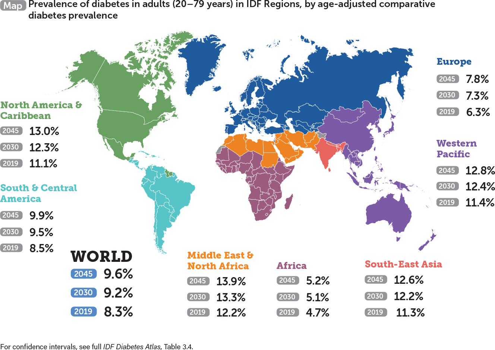

# Project-HealthCare
> The study objective: ML comparisons for diabetes dataset. 

## Table of contents
* [General info](#general-info)
* [Diabetes](#image)
* [Packages and approaches](#R)
* [Status](#status)
* [Inspiration](#inspiration)
* [Files](#files) 

## General info
According to Centers for Disease Control and Prevention by 2050, the diebtes rate could skyrocket so with this ML comparison we will be able to find the best model to predict the future dibetics cases.

## Diabetes
According to diabetesatlas.org in 2019, the estimated number of people over 65 years of age with diabetes is 111 million. It is projected that by 2030 the number of people over 65 with diabetes will increase to 195 million.

diabetesatlas.org
 

## Packages and approaches
sklearn, pandas, numpy,matplotlib, seaborn

#### Code Example - Lipinski’s Rule application
    scores = []
    for name, clf in zip(names, classifiers):
    clf.fit(X_train, Y_train)
    score = clf.score(X_test, Y_test)
    scores.append(score)
  
Accuracy scores for the models are recorded!
  
## Status
Project is completed.

## Inspiration
Characterizing the best ML model for diebetes incident prediction.

## Files 
Ref codes: https://github.com/melaniaAB/Project-HealthCare.git
